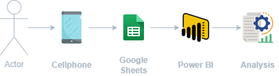

<h1 align="center">  
GYM-Dashboard
</h1>

<h2 align="center">  
Project Status
</h2>

<h4 align="center">  
🚀 Finished 🚀 
</h4> 

## 💻 About

GYM-Dashboard is a project to help people understand their progress in the gym by providing a dashboard to analyze their progress.

Click at link below to test the dashboard:

[GYM-Dashboard](https://app.powerbi.com/view?r=eyJrIjoiNTU4ZGQ5YzEtZjA4YS00YjRlLTk1MTQtZjJkMDU3YWY0NDQ5IiwidCI6IjA5ODFkMTdkLTFmYzItNDFjNy04MDE1LWQwZjljNTM2MGM1NiJ9)

## 🧰 Tools

    
    
    

## ⚙️ How it works

### Diagram

1. User use **Cellphone** to access app of **Google Sheets**.
2. Data is saved in a table on app of **Google Sheets**. The table have four columns: 
   * Date;
   * Exercise;
   * Serie;
   * Repetitions;
   * Weight.
3. Table in **Google Sheets** is connected to **Power BI**.
4. **Power BI** is used to perform the **Analysis**.

### Dashboard

The dashboard is composed by two pages:
   * **General Analysis**;
   * **Analysis by Exercise**.

The purpose of **General Analysis** is to perform an analysis of the big picture, like to show how many days you went to gym this month or the evolution of how many weights you are lifting by month. 

The purpose of **Analysis by Exercise** is to perform a specific analysis by exercise and understand its progress, like to show the evolution of the weights and series over time.

## 🙋‍♂️ Author   
  
Made by Caio Henrique 👋 [Get in Touch!](https://www.linkedin.com/in/caioandreatti/)

## 📝 License
  
This project is under the license [MIT](./LICENSE).